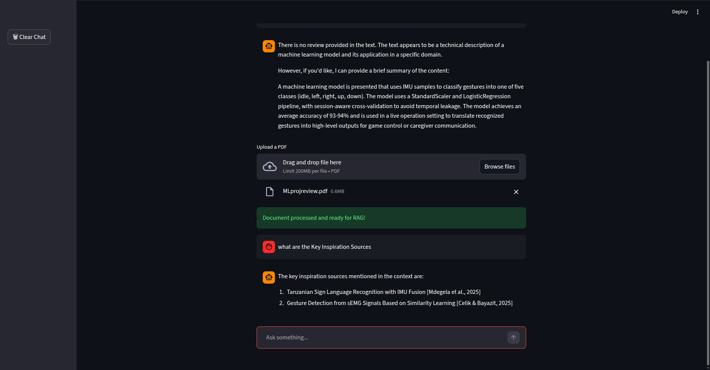

# 🚀 Groq RAG Chatbot

A Retrieval-Augmented Generation (RAG) chatbot built using Streamlit and Groq LLM API.  
Supports PDF document upload, semantic search, and chat history persistence.

---

## ✨ Features

- Interactive chat interface using Streamlit  
- LLM inference via Groq API  
- RAG pipeline using FAISS vector store  
- PDF document upload and processing  
- Local embeddings using Sentence Transformers  
- Chat history stored in SQLite  
- Clear chat functionality  

---

## 🧠 Architecture

User Input  
→ Retrieve relevant chunks (FAISS)  
→ Inject context into prompt  
→ Groq LLM generates answer  
→ Save conversation to SQLite  

---

## 🛠 Tech Stack

- Python  
- Streamlit  
- Groq API (Llama 3.1 8B Instant)  
- FAISS  
- Sentence Transformers  
- SQLite  
- LangChain  

---

## 📷 Screenshots

### Chat Interface

### RAG Response
