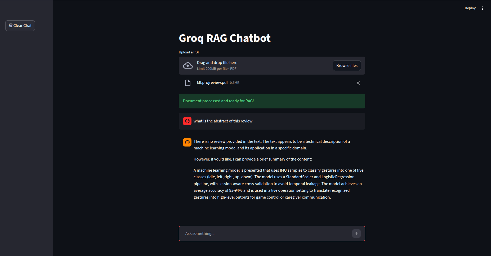

Groq RAG Chatbot

A Retrieval-Augmented Generation (RAG) chatbot built using Streamlit and Groq LLM API.
Supports PDF document upload, semantic search, and chat history persistence.

Features

Chat interface using Streamlit
LLM inference via Groq API
RAG pipeline using FAISS
PDF document upload
Local embeddings with sentence-transformers
Chat history stored in SQLite
Clear chat functionality

Architecture

User Input
→ Retrieve relevant chunks (FAISS)
→ Inject context into prompt
→ Groq LLM generates answer
→ Save conversation to SQLite

Tech Stack

Python
Streamlit
Groq API (Llama 3.1 8B)
FAISS
Sentence Transformers
SQLite
LangChain

